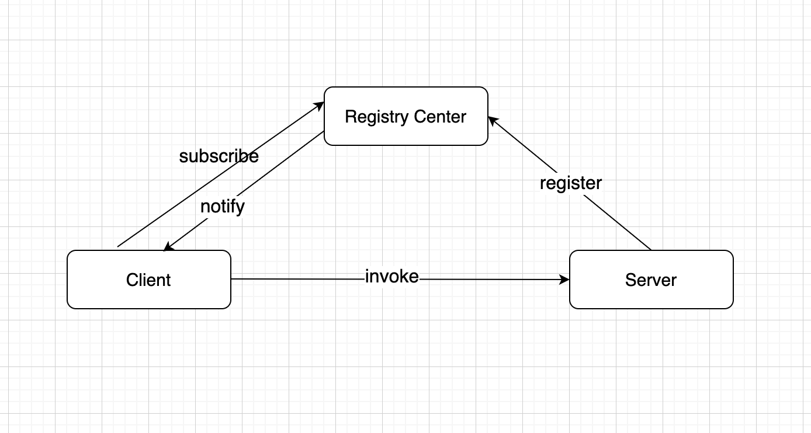

# prpc
an rpc framework

## 1 Architecture

## 2 Features

- [ ] 注册中心
    - [x] zookeeper
    - [ ] redis
- [ ] 负载均衡
    - [x] Random
    - [x] RoundRobin
    - [ ] WeightRandom
    - [ ] WeightRoundRobin
    - [ ] idc负载
- [ ] 失败重试策略
    - [x] fastfail
    - [ ] fastover
- [ ] 序列化协议
    - [x] protobuf
    - [x] json
- [ ] 应用协议兼容
    - [ ] dubbo
    - [ ] http
    - [ ] brpc
- [ ] 限流
    - [ ] 计数器算法
    - [ ] 令牌桶算法
    - [ ] 漏桶算法
- [ ] 熔断
- [ ] prpc管理后台
- [ ] 集成spring-boot

## 3 TODO

一些待优化的事情记录

- [ ] 协议优化，分别读写meta、request、response等
- [x] shutdown hook，在服务关闭的时候及时清理zk节点
- [ ] zookeeper server节点优化，定义prpc协议，例如: prc://127.0.0.1:9999?idc=nj&weight=10
- [ ] 通信预热
- [ ] naming service，支持命名方式解析
- [ ] config数据结构优化，清晰一些
- [ ] 支持多端口启动，例如服务同时需要支持dubbo和prpc协议，需要启动两个端口，分别接收请求

## 4 Quick Start

## 5 User Feedback

